# Ultra Agent Memory — Implementation Decision Flow

This is a deliberately simplified roadmap view of the project. It combines the implementation phases in the documentation roadmap with the ordering and rebuildability requirements in the normative architecture corrections.

```mermaid
flowchart TD
    S([Start: architecture and specification phase]) --> P0["Phase 0 — Formal model<br/>Ontology, schemas, IDs, evidence, canonical/derived boundary, event journal"]
    P0 --> D0{"Are the ontology, schemas,<br/>and invariants specified enough<br/>to implement safely?"}
    D0 -- "No: refine focused specifications" --> P0
    D0 -- "Yes" --> P1["Phase 1 — Canonical core<br/>Markdown/Git, revisions, supersession, evidence references, validation, API/CLI, SQLite metadata"]
    P1 --> D1{"Can projections be rebuilt from<br/>canonical Markdown + immutable evidence<br/>+ semantic and interaction/audit history?"}
    D1 -- "No: close the event or rebuild gap" --> P1
    D1 -- "Yes" --> P2["Phase 2 — Basic hybrid retrieval<br/>FTS/BM25, memory/field/sentence/claim indexes, embeddings, entity adjacency, full-fusion baseline, RRF, explainRecall, Context Compiler"]
    P2 --> D2{"Does every candidate stream pass<br/>security and applicability checks<br/>before fusion, bounding, or reranking?"}
    D2 -- "No: correct retrieval ordering" --> P2
    D2 -- "Yes" --> P3["Phase 3 — Agent lifecycle integration<br/>MCP; session, prompt, tool, stop, and precompact hooks; Git capture; checkpoint/resume; task continuity"]
    P3 --> D3{"Does runtime record provenance-on-use<br/>and durable interaction/outcome events<br/>for retrieved, included, and used memories?"}
    D3 -- "No: add runtime audit capture" --> P3
    D3 -- "Yes" --> P4["Phase 4 — Evidence and governance<br/>Review, correction, provenance, contradiction, authority, scope, privacy, promotion, and demotion"]
    P4 --> D4{"Are writes and retrievals<br/>policy-gated, reviewable,<br/>and privacy-safe?"}
    D4 -- "No: strengthen governance" --> P4
    D4 -- "Yes" --> P5["Phase 5 — Graph and temporal cognition<br/>Bitemporal/as-of queries; graph, causal, and contradiction retrieval; anchors; branch, worktree, and commit validity"]
    P5 --> D5{"Are historical and code-state<br/>validity rules explicit<br/>and testable?"}
    D5 -- "No: formalize temporal and code-state rules" --> P5
    D5 -- "Yes" --> P6["Phase 6 — Cognitive enrichment<br/>Decay/FSRS, novelty, activation, salience, clustering, consolidation, beliefs, mental models; optional Hopfield mechanisms"]
    P6 --> D6{"Are adaptive capabilities<br/>versioned, evaluated, reviewed,<br/>and reversible?"}
    D6 -- "No: keep them candidate/proposed" --> P6
    D6 -- "Yes" --> P7["Phase 7 — Multi-agent and operations<br/>Agent messages, TODO queues, sync, replay, health/debt, evaluation, and learned ranking"]
    P7 --> E(["Operate, evaluate, reconcile,<br/>and iterate through the next focused specification"])

    C["Cross-cutting throughout<br/>Version schemas/models/prompts/policies; preserve superseded decisions; emit audit events; run fsck/reconciliation and evaluation"] -.-> P0
    C -.-> P1
    C -.-> P2
    C -.-> P3
    C -.-> P4
    C -.-> P5
    C -.-> P6
    C -.-> P7

    classDef phase fill:#e8f1ff,stroke:#3b6ea8,color:#102a43
    classDef decision fill:#fff4d6,stroke:#b7791f,color:#4a2c0a
    classDef control fill:#f0e7ff,stroke:#805ad5,color:#322659
    classDef terminal fill:#e6ffed,stroke:#2f855a,color:#174b2b

    class P0,P1,P2,P3,P4,P5,P6,P7 phase
    class D0,D1,D2,D3,D4,D5,D6 decision
    class C control
    class S,E terminal
```

## How to read it

- Rectangles are implementation phases; diamonds are readiness or safety decisions.
- A backward edge means the current phase must be refined before the project advances.
- The security/applicability gate intentionally appears before retrieval fusion, candidate bounding, or reranking.
- The rebuild gate includes both canonical semantic history and canonical interaction/audit history because usage-derived projections must remain reconstructable.
- The phase order is a roadmap, not an irreversible commitment. Later specifications may refine or supersede decisions while preserving their history.

## Source documents

- [Architecture overview](../ARCHITECTURE_OVERVIEW.md)
- [Coverage-audit additions](../ARCHITECTURE_COVERAGE_AUDIT_ADDITIONS.md)
- [Review corrections](../ARCHITECTURE_REVIEW_CORRECTIONS.md)
- [Documentation and diagram roadmap](../DOCUMENTATION_ROADMAP.md)
